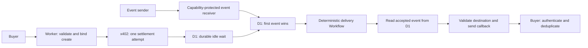

# Wait — durable event waiting for autonomous agents

[](https://github.com/EdgecaseSystems/wait-public/actions/workflows/ci.yml)

**Live service:** [Website](https://wait-site.edgecasesystems.workers.dev/) · [API](https://wait.edgecasesystems.workers.dev/) · [OpenAPI](https://wait.edgecasesystems.workers.dev/openapi.json) · [Create-wait endpoint](https://wait.edgecasesystems.workers.dev/v1/waits)

**Portfolio evidence:** 225 automated tests at publication (178 unit + 47 Workers-runtime integration tests) · TypeScript · Cloudflare Workers/D1/Workflows · x402 payments · passing CI

An agent often needs to pause until another system sends an event. Keeping the agent running or repeatedly polling wastes resources and complicates recovery. Wait stores a temporary event receiver, accepts one future JSON event, and delivers it to the buyer's HTTPS callback.

**The production Wait service is live and designed for largely autonomous machine-to-machine operation.** Once deployed and configured, the normal purchase, waiting, event acceptance, and callback-delivery lifecycle runs without a human operator. Human intervention is reserved for exceptional payment reconciliation, operational maintenance, or other unusual remediation cases.

**This repository is a sanitized portfolio snapshot of the independently developed service.** It preserves the implementation and tests while replacing production identifiers and omitting credentials, private operational records, and deployment access. The public snapshot is not connected to production and is not an open-source release. [Rights and limited portfolio-evaluation permission](NOTICE.md).

## What the service does

1. A buyer creates a wait with a timeout, callback URL, and idempotency key.
2. The service returns separate event-receiver and status capabilities and a callback authentication token.
3. The first valid event is accepted durably. No delivery Workflow runs while the wait is idle.
4. A short Workflow reads the accepted event from D1 and attempts authenticated callback delivery with bounded retries.
5. The buyer authenticates and deduplicates callbacks by `wait_id`.

This is event-driven waiting for one event, **not scheduled wake-up or URL polling**. The illustrated offer covers 60 seconds through 24 hours. Callback delivery is bounded at-least-once, so receivers must tolerate duplicates.

## My role and the development approach

I led the product concept, architecture decisions, behavioral requirements, risk identification, testing strategy, debugging direction, and quality control. AI coding agents implemented much of the code. I directed the investigation of failures, compared implementations against known working behavior, questioned unsafe assumptions, and required focused regression coverage.

Wait and its companion [SecondLook](https://github.com/EdgecaseSystems/secondlook-public) were developed during the late-August to early-September 2026 EdgecaseSystems build period. These public repositories have fresh history and do not reproduce the private development chronology. The work demonstrates AI-assisted systems development and technical judgment; it does not imply that I manually authored every line.

## Engineering problems solved

| Problem | Design decision | Evidence to inspect |
| --- | --- | --- |
| Long waits should not occupy a running execution | Store idle waits in D1; create a Workflow only after an event wins | [Repository transitions](src/repository.ts), [delivery provisioning](src/delivery-provisioning.ts), [Worker integration tests](test/integration/d1-workflow.test.ts) |
| Duplicate creates or events could duplicate purchased work | Separate durable facts for request identity, payment, entitlement, winning event, and delivery identity | [Idempotency](src/idempotency.ts), [state handling](src/state.ts), [lifecycle tests](test/integration/public-lifecycle.test.ts) |
| A failed HTTP response does not prove settlement failed | One settlement attempt; retain ambiguity and bound the one-cent ambiguity-honor policy with a cumulative fuse | [Payment adapter](src/x402-payment-adapter.ts), [payment lifecycle tests](test/integration/x402-payment-lifecycle.test.ts) |
| Subtle payment authentication differences can break integration | Explicit JWT construction, exact request binding, and protocol regression tests | [x402 adapter tests](test/x402-payment-adapter.test.ts), [mainnet adapter tests](test/x402-mainnet-payment-adapter.test.ts) |
| Buyer callbacks can target unsafe destinations or redirect elsewhere | Revalidate before each outbound attempt, disallow redirects, retain the public-fetch network boundary | [Callback policy](src/callback-policy.ts), [delivery Workflow](src/delivery-workflow.ts), [egress tests](test/callback-egress.test.ts) |
| Key rotation can break recovery or reconstruct the wrong capability | Resolve strictly by the persisted key version; never fall back across versions | [Key selection](src/capability-keys.ts), [key-version tests](test/capability-keys.test.ts) |
| Event data and credential-bearing paths can leak through storage or logs | Content-minimized Workflow state, explicit retention, and disabled invocation logs/traces | [Retention cleanup](src/retention-cleanup.ts), [configuration tests](test/wrangler-config.test.mjs), [security contract tests](test/security-contract.test.mjs) |

## Architecture



Cloudflare Workers handles HTTP requests, D1 decides durable race winners and stores obligations, and Workflows manages short callback delivery attempts. The service itself uses deterministic logic and does not require AI inference. [Architecture and trust boundaries](docs/ARCHITECTURE.md).

## Inspect and validate

Start with the problem/evidence table and [API guide](docs/API.md). The canonical OpenAPI contract lives in [src/openapi.ts](src/openapi.ts), served as `/openapi.json` by the Worker. Discovery and buyer guidance are retained alongside it.

Prospective employers and portfolio reviewers may clone and execute the sample locally under the limited evaluation permission in [NOTICE.md](NOTICE.md). Use Node.js 22.13 or newer:

```text
npm ci --no-audit --no-fund
npm run verify:offline
```

This checks generated Worker types, TypeScript, unit tests, local Workers-runtime integration tests, and a Wrangler dry-run bundle. External payment and callback effects are mocked. No production Cloudflare account, wallet, or API key is needed. The GitHub workflow runs this gate and has no deployment or production monitoring job.

## Publication boundaries and limitations

Production credentials/configuration are intentionally omitted. The database UUID is a placeholder, Worker/Workflow names are separate portfolio names, service/support addresses inside the snapshot use reserved example domains, and preview and workers.dev publication are disabled in the snapshot configuration. The configuration's zero payment recipient is intentionally invalid; the separately labeled synthetic recipient in adapter tests must never receive funds. No private Git history, operational records, incident evidence, credential material, or live monitoring jobs were exported.

The live links at the top of this README point to the separately deployed production service and landing page; they do not make this sanitized repository a production configuration. Public USDC contract addresses and protocol constants are retained because they explain validation; they are not the operator's wallet. Included prices and service text describe the example contract, not a commercial offer from this repository. Directory metadata is explicitly illustrative and makes no listing claim.

Callback syntax checks alone do not prevent every DNS-based SSRF route. The design also depends on Cloudflare's `global_fetch_strictly_public` boundary for ordinary global fetch. Local mocked tests do not independently prove Cloudflare's live network behavior. At-least-once delivery is not exactly-once execution at the buyer.

See [publication review](docs/PUBLICATION_REVIEW.md) for the sanitization scope and validation evidence.

## Rights

Copyright (c) 2026 EdgecaseSystems. All rights reserved to the extent applicable. No open-source or general reuse license is granted. A narrow permission for prospective employers and other portfolio reviewers to clone and execute the snapshot locally for evaluation is described in [NOTICE.md](NOTICE.md). GitHub's Terms of Service and applicable law still apply, including GitHub's viewing and forking functionality. Third-party components retain their own licenses.
